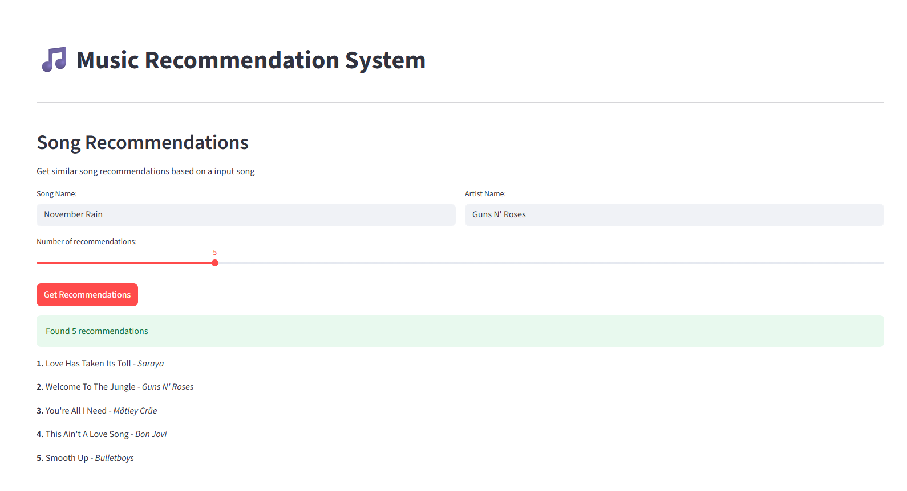
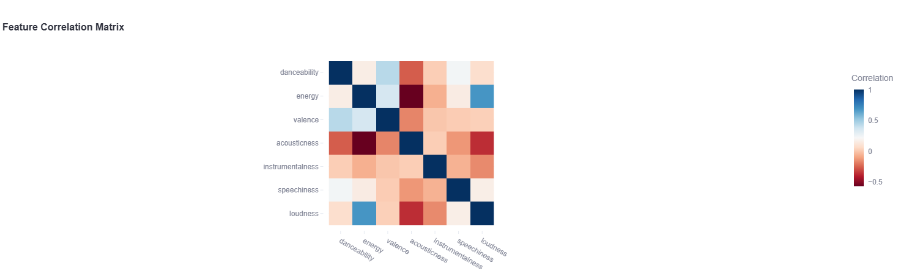

#  Music Recommendation System

A machine learning based music discovery platform that combines audio feature analysis and lyrics processing to deliver personalized song recommendations and mood/genre-based playlist generation. Built using `scikit-learn` algorithms including K-Nearest Neighbors and K-Means clustering. Integrated with `Streamlit` for an interactive web experience, this system analyzes musical characteristics like energy, valence, and danceability to understand music preferences and suggest similar tracks. Processes data from a `20k` song dataset.

##  Features

###  Song Recommendations
Find songs similar to an input track using a K-Nearest Neighbors model with cosine similarity that analyzes both audio features and lyrical content.



###  Playlist Generator
Create custom playlists using multiple methods:
- **Custom Requests**: Natural language input (e.g., "sad metal", "happy pop")
- **Quick Options**: One-click buttons for popular categories (Party, Random, Sad, Happy, Energetic, Rock, Pop)
- **Mood-Based**: Intelligent mood detection using audio feature thresholds
- **Genre-Filtered**: Filter by specific music genres

###  Data Visualization
Explore your music collection through interactive visualizations:
- **Cluster Analysis**: 
        - K-Means clustering with robust scaling preprocessing (chosen to handle outliers in music data)
        - PCA projection of song clusters
        - Fixed optimal k=5, obtaining a `silhouette score` of `0.914`
- **Feature Distributions**: Histograms of audio characteristics
- **Correlation Matrix**: Heatmap showing relationships between different audio features




- **Mood Analysis**: Pie chart distribution of detected mood categories
- **Genre Distribution**: Top 10 genres in your collection

###  Dataset Explorer
Advanced search and filtering capabilities:
- Search by song name or artist
- Filter by mood category
- Filter by music genre
- Interactive data table with key song information

## Key Algorithms

 - `K-Nearest Neighbors`: For finding similar songs based on feature vectors
 - `K-Means Clustering`: Groups songs with similar characteristics
 - `TF-IDF + SVD`: Processes and reduces dimensionality of lyrics data
 - `Custom Mood Detection`: A rule-based system using audio features

## Installation

### 1. Clone the repository:
   ```bash
   git clone https://github.com/adrianageamanu/Music-Recommendation-System.git
   cd Music-Recommendation-System
   ```
### 2. Set up a virtual environment:
   ```bash
   python3 -m venv venv  # Try 'python' if 'python3' is not available
   source venv/bin/activate
   ```
### 3. Install Python dependencies:
   ```bash
   pip install -r requirements.txt
   ```


## Usage

###  Run the script:
   ```bash
   streamlit run music.py  # Try 'python' if 'python3' is not available
   ```

## Dataset
Downloaded the dataset from https://marianaossilva.github.io/DSW2019/#downloads, combining csv files from `musicoset_metadata.zip` and `musicoset_songfeatures.zip`

## Notes
The dataset is quite large, so the web app may take a little while to load. Optimizations are planned for the future.